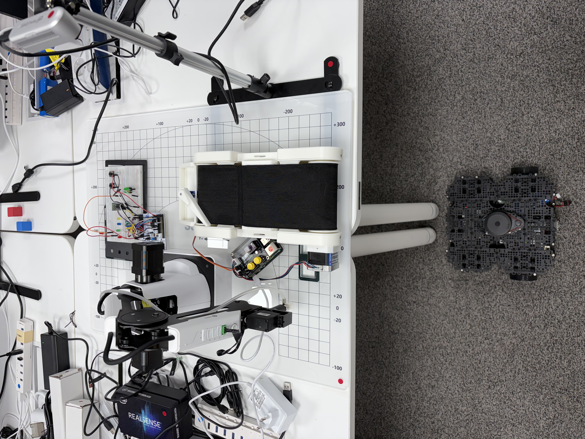

# 🗓️ X_Week MINUTE / 25.11.30

## ✅ 1. Done

권순재 - 모드버스 LOG 구현, 컨베이어 벨트 연결, Main 디버깅, 변환 행렬 통해 Dobot 좌표점 Real Sense 카메라와 연동, ROS2 터틀봇 결합 구현

류광철 - STM32 추가적인 요청 구현, slam, conveyor modbus 통신 구현

## 🗒️ 2. Evidence

## ⚠️ 3. Issues / Improvements

- Dobot 움직임의 예상치 못한 특이점
- 전체적인 공정 과정의 논리의 미흡

## 💪 4. Decisions

- 지난주 이슈는 관통프로젝트 주차에 재검증
- 웹 구현, 예방진단 계획

## 📊 5. Progress

- 공정 (95%)
- 웹 구현 (0%)
- 예방진단 (0%)

## 🎯 6. Next Goals

### 가장 큰 목표는 웹과 예방진단 계획!!!

권순재 - 예방진단 - 공부(장비: 두봇(MAIN), 컨베이어 등), Main Logic 일부 수정

류광철 - 웹 - 로그 웹으로 넘어가기, 장비 상태 모니터링, 전류 전압 실시간 그래프 시각화, 고장 데이터 뜨면 경고 표시, 터틀봇 현재 위치 시각화, 디지털 트윈
