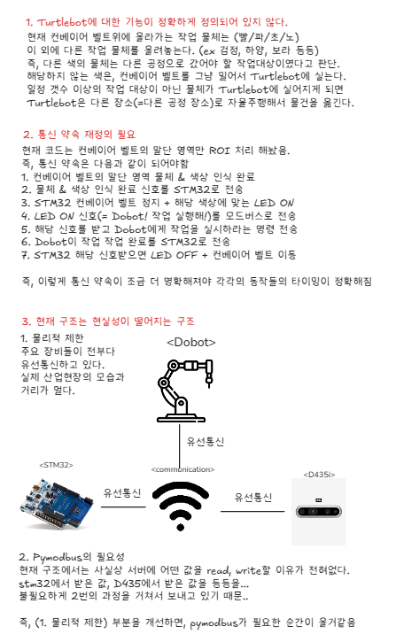

## 🗓️ X_Week MINUTE / 25.11.16

### ✅ 1. Done
권순재 - 물류 장비 Python 코드 모듈화

류광철 - STM32 LED, EMERGENCY, UART 구현

### 🧪 2. Evidence

### ⚠️ 3. Issues / Improvements
1. Turtlebot 역할 정의 불명확
2. 통신 시퀀스 재정립 필요
3. 유선 통신의 한계

### 🧩 4. Decisions
#### Turtlebot 역할
다른 색의 박스는 분류 작업을 실시하지 않고, TurtleBot에 실어 다른 공정으로 자율주행하여 이동시킨다.

#### 통신 시퀀스 재정립 필요
보완 진행

#### 유선 통신의 한계
Dobot은 실제 작업 공간에 설치된 장비이고, STM32는 관제소 역할을 하는 장치로 분리되어 있다.

따라서 Dobot은 기존처럼 유선 방식으로 운영하되, STM32는 블루투스 기반으로 구조를 변경한다.

#### 빠르지 않다
이번 프로젝트의 핵심은 기본적인 물류 공정 시스템을 빠르게 구현하고, 설비 예방 진단에 집중해 투자하는 것

### 📊 5. Progress
물류 공정 시스템 (45%)

### 🎯 6. Next Goals
권순재 - 회의록 양식 GIT 업로드 / Python main.py 보완 / 설비예방진단 래퍼런스 공부

류광철 - STM32 기능 변경 / 블루투스 통신 구현 / 설비예방진단 래퍼런스 공부