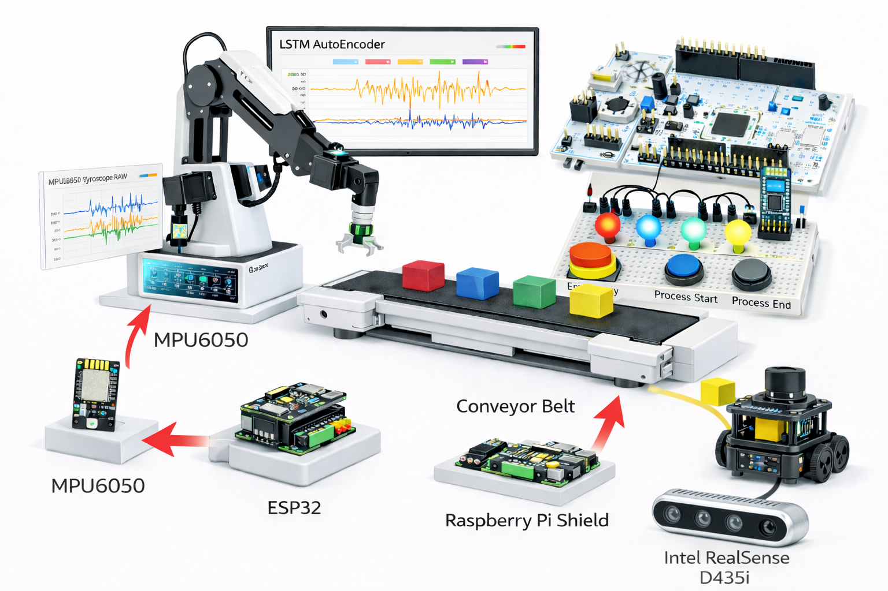
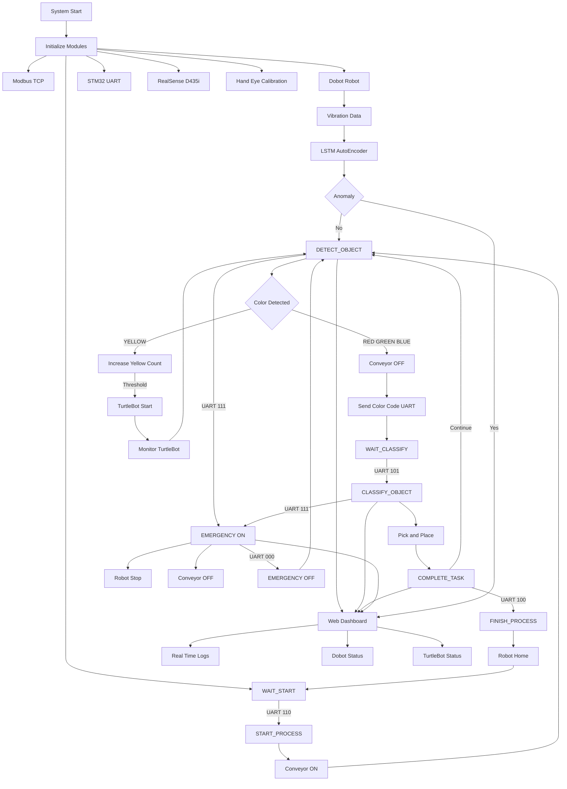

# Intelligent Robotic Sorting System with PdM


<p align="center">
  
</p>

This project implements an **intelligent robotic sorting system** that integrates **RGB-D vision, industrial robot control, embedded systems, predictive maintenance (PdM), and web-based monitoring**.

A Dobot manipulator performs **color-based object sorting** using an Intel RealSense D435i camera, while STM32/ESP32-based embedded devices handle **real-time signaling and safety control**. The overall system is coordinated through a **Modbus TCP–based industrial communication layer**, with additional support for **mobile robot (TurtleBot) interaction**.

In addition, a **web-based dashboard** provides **real-time visualization of system logs, Dobot status, and TurtleBot status** via WebSocket communication, enabling intuitive monitoring and operational awareness.

Furthermore, vibration data collected from the robot base is analyzed using an **LSTM AutoEncoder** to detect early signs of abnormal behavior, enabling **data-driven preventive maintenance** in a smart factory environment.

## System Video

<p align="left">
  <a href="https://www.youtube.com/watch?v=CyqiWDAXQRI">
    
  </a>
</p>


## Table of Contents
- [Team & Development Period](#team--development-period)
- [System Flow](#system-flow)
- [Hardware](#hardware)
- [Installation](#installation)
- [Execution](#execution)


<a name="team--development-period"></a>
## Team & Development Period
- Development Period: 2025.11.10 – 2025.12.25
<table align="center">
  <tr>
    <td align="center">
      <br>
      <sub><b>SSAFY_14TH_권순재</b></sub>
    </td>
    <td align="center">
      <br>
      <sub><b>SSAFY_14TH_류광철</b></sub>
    </td>
  </tr>
</table>

<a name="system-flow"></a>
## System Flow

The following diagram describes the actual execution flow of the system,
based on the implemented state machine, embedded communication,
robot control logic, web monitoring, and predictive maintenance pipeline.



<a name="hardware"></a>
## Hardware

### Control & Computing
**Control PC (Ubuntu 22.04 / Windows 11)**  
- Executes the main state machine and overall system control  
- Handles vision processing, robot control, WebSocket server, and PdM inference  

---

### Robot & Mobility
**Dobot Magician**  
- Performs pick-and-place operations on the conveyor  
- Responsible for color-based object sorting  

**TurtleBot (ROS2 + Nav2)**  
- Executes missions when specific conditions are met (e.g., yellow object threshold)  
- Performs autonomous navigation using SLAM and returns to the home position  

---

### Vision
**Intel RealSense D435i (RGB-D Camera)**  
- Captures color and depth information  
- Performs color-based object detection using OpenCV  
- Uses hand–eye calibration for coordinate transformation between camera and robot  

---

### Embedded Devices
**Raspberry Pi**  
- Dedicated embedded controller for the conveyor belt system  
- Communicates with industrial devices via Modbus TCP  

**STM32**  
- Handles process control and state signaling  
- Communicates with the control PC via UART  

**ESP32**  
- Collects sensor data from the MPU6050  
- Transmits data to the control PC via serial communication  

**MPU6050 (IMU Sensor)**  
- Measures vibration data from the robot base  
- Provides input data for predictive maintenance analysis  

---

### Communication
**UART**  
- State and control signal communication between STM32 and the control PC  

**Modbus TCP**  
- Controls the conveyor belt system via the Raspberry Pi  

**WebSocket**  
- Streams real-time system status and logs to the web dashboard  

<a name="installation"></a>
## Installation

```bash
# (optional) create virtual environment
python -m venv venv
source venv/bin/activate  # Linux / macOS
# venv\Scripts\activate   # Windows

# install dependencies
pip install --upgrade pip
pip install -r requirements.txt
```

<a name="execution"></a>
## Execution

```bash
# ==============================================================
# Prerequisites
# ==============================================================
# - LSTM AutoEncoder model must be trained in advance
# - Trained model file (.h5 / .pkl) must be placed in the model directory
# - All devices must be on the same network
# - Replace placeholders (<...>) with your own environment settings


# ==============================================================
# Ubuntu / Raspberry Pi
# 1. Conveyor Control
# ==============================================================
ssh <USER>@<RASPBERRY_PI_IP>
cd <PROJECT_DIRECTORY>
python gwang_pjt.py


# ==============================================================
# Ubuntu / TurtleBot
# 2. TurtleBot Bring-up & Navigation
# ==============================================================
ssh <USER>@<TURTLEBOT_IP>

# Bring up TurtleBot hardware
ros2 launch turtlebot3_bringup robot.launch.py usb_port:=/dev/ttyACM*

# Start Navigation2 with a pre-built map
ros2 launch turtlebot3_navigation2 navigation2.launch.py \
use_sim_time:=True \
map:=<MAP_FILE_PATH>

# Teleoperation (set initial pose manually)
ros2 run turtlebot3_teleop teleop_keyboard


# ==============================================================
# Ubuntu / Control PC
# 3. SLAM & ROS Bridge
# ==============================================================
cd <PROJECT_ROOT>/SLAM
python3 slam.py

ros2 launch rosbridge_server rosbridge_websocket_launch.xml


# ==============================================================
# Windows / Main Control PC
# ==============================================================
# 0. Device check
# - Dobot Magician connection
# - Bluetooth (UART / HC-05)
# - Intel RealSense D435i


# 1. Hand–Eye Calibration (CALIB_POINTS)
python main.py


# 2. ROI configuration
# (Set ROI interactively via vision window)


# 3. Modbus TCP Server
python server.py


# 4. Main Process Execution
python main.py


# 5. Web Dashboard (Frontend)
cd front
npm run dev -- --host


# 6. Backend Server
npm start


# 7. WebSocket Server
python ws.py
```
