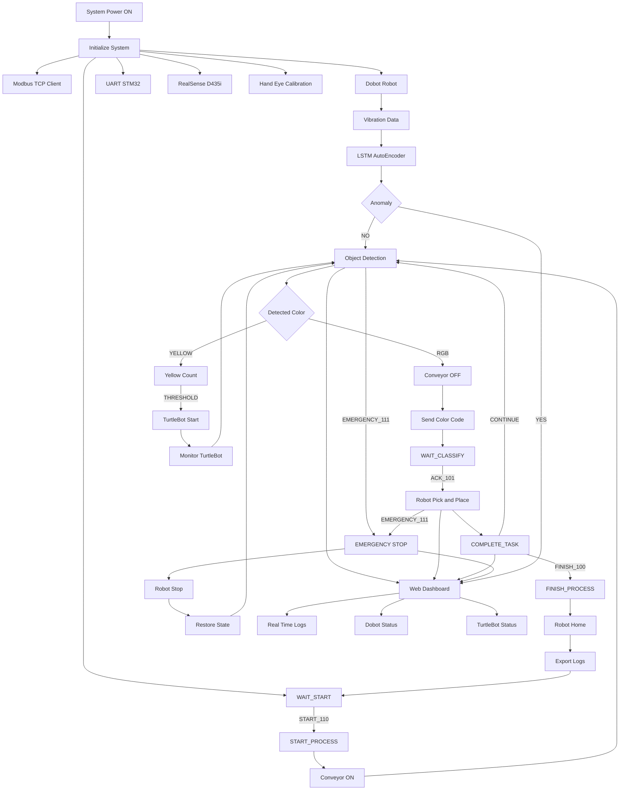

# Intelligent Robotic Sorting System with PdM

  

This project implements an **intelligent robotic sorting system** that integrates **RGB-D vision, industrial robot control, embedded systems, predictive maintenance (PdM), and web-based monitoring**.

A Dobot manipulator performs **color-based object sorting** using an Intel RealSense D435i camera, while STM32/ESP32-based embedded devices handle **real-time signaling and safety control**. The overall system is coordinated through a **Modbus TCP–based industrial communication layer**, with additional support for **mobile robot (TurtleBot) interaction**.

In addition, a **web-based dashboard** provides **real-time visualization of system logs, Dobot status, and TurtleBot status** via WebSocket communication, enabling intuitive monitoring and operational awareness.

Furthermore, vibration data collected from the robot base is analyzed using an **LSTM AutoEncoder** to detect early signs of abnormal behavior, enabling **data-driven preventive maintenance** in a smart factory environment.

## Table of Contents
- [Team & Development Period](#team--development-period)
- [System Flow](#system-flow)
- [Hardware](#hardware)
- [Installation](#installation)
- [Execution](#execution)
- [Run](#run)

## Team & Development Period
- Development Period: 2025.11.10 – 2025.12.25
<table align="center">
  <tr>
    <td align="center">
       
      <b>SSAFY_14TH_권순재</b>
    </td>
    <td align="center">
       
      <b>SSAFY_14TH_류광철</b>
    </td>
  </tr>
</table>

## System Flow
